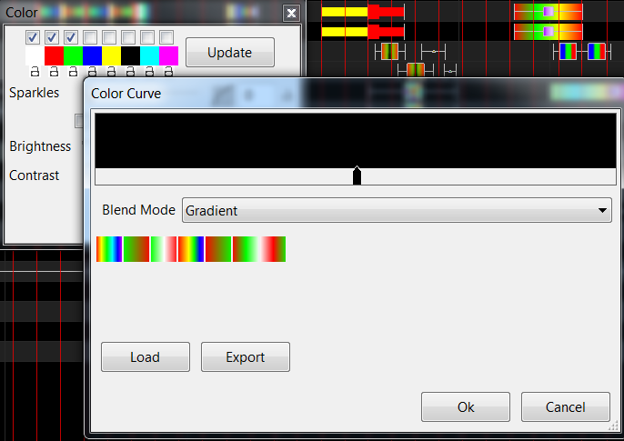
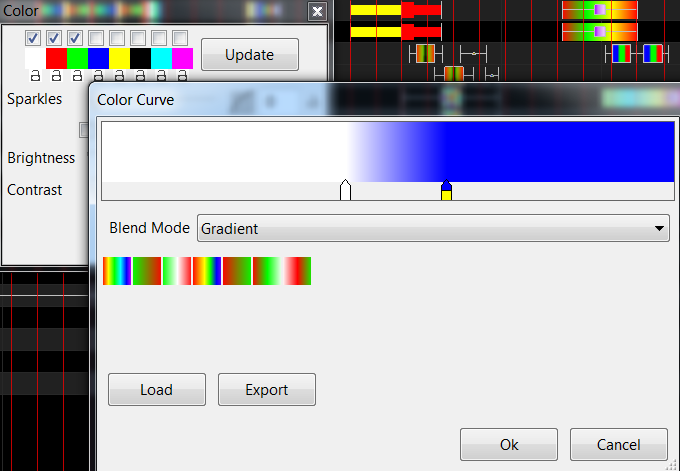
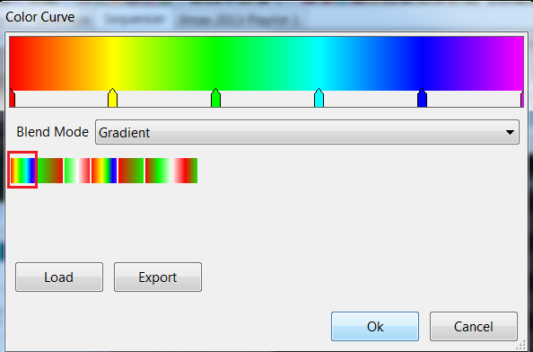

# Changing Color Settings

## Changing Color Settings

From the Color window, you can change the Colors that apply to the effect, as well as the Sparkles, Brightness and Contrast values. How effects use the colors is defined by the effect. Some support just one, some support up to 8.

.png>)

The 'Update' button will apply the current colors palettes to all the selected effects.

.png>)

Use the Sparkles slider to increase the sparkles for the effect. If the Sparkles reflect music option is selected, then the sparkles will increase from the selected value based on the intensity of the music. The Sparkles color can be changed with the color picker on the right side.

.png>)

Use the Brightness slider to increase or decrease the brightness of the effect.

.png>)

You can open/close the Color Window by Clicking on the Effect Colors icon in the toolbar.

 (1).png>)


If this window is not open, select and open the Window from the Views, Window menu. You can save all your window positions as a “Perspective” for easy recall.


## Changing Colors

To change the colors used by an effect, select the effect, and double click the color that needs to be modified.

.png>)

The Color Manager Dialog allows the use to then select a different color.

 (1).png>)

The user can create custom colors by clicking "Define Custom Colors" and manually adjusting the RGB color settings.

.png>)

For any effect, you can change the initial colors selected for the effect by selecting a different color or colors from the Color Window. You can use the Control key and select multiple effects.

Once you select all the effects and change the color , hit the 'Update' button in the color panel. It will modify just the colors for all selected effects.

.png>)


Clicking on the any of the color icons opens up a Palette window, where the standard colors can then be replaced with a new standard color or a custom color can be selected.


## Color Palettes

The Save button allows the user to save the current selected color for future use as a color palette. These color palette files are stored in the current show folder.

.png>)

The Drop-Down allows the user to select the previously saved color palette stored in the show folder.

 (1).png>)

The update button will save any pending changes to the currently selected color palette file. Delete will delete the selected color palette file. If the user hovers over the color palette, the file name will appear.

 (1).png>)

## Color Curves

This functionally enables a color to change within an effect duration I.E. where previously the same color value would have been displayed for a particular segment duration it can now be made to change within that segment duration.

As an example, drop a Bars effect against a model on the grid.

After selecting the required colors (white, red and green in this example), right click on the first color .

.png>)

The Color Curves window is displayed.

The window representing the Color curve is black in color.

Double click on the mark (which turns yellow to indicate it has been selected) and from the resulting Palette window select a color (White).

Move the marker to the far left. Then click within the White Color curve window. This creates another mark , Double click on that mark and select Blue as a Color.

You now have a color effect that starts White and Turns blue over the duration of the effect.

You can adjust the markers to control where the color changes.

You can have up to 40 different color changes.

The Blend Mode can be set to Gradient or None (sharp change).

For effects that have the Platte color option (such as the Butterfly), the Palette must be selected for the colors to come into play.

You can select any one of the color curves present just below the Blend Mode attribute by clicking on it.

The color curve values will be copied into the window just above and you can then use the markers to adjust the color.

To can export a color curve by clicking on the Export button. You will be prompted to specify a name for the Color curve and a .xcc file of the specified name will be created in the location specified.

Similarly you can load a previously exported color curve file by clicking on the load button and then navigating to the location of a .xcc file and selecting it.

### Types of Color Curves

Color curves can be timed based or spatial based. A timed based color curve will change color over the duration of the effect, while a spatial color curve will change over the models X/Y location. A spatial color curve has direction. The icon below the color specified what type of color curve is selected. Click the icon to change the color curve type. A clock is a time based and an arrow is used for a spatial color curve. The Direction of the arrow represents the direction of the spatial color curve.

.png>)

This functionality works on most effects but not all. For example – it is not applicable to effects such as DMX, Faces, Fire, Glediator, Pictures, State and Video.

## Single Channel Colors

Single Channel colors react only to the color that they are defined as. If you define them as single color blue then it will only react to the blue channel. You can set any color and it will route the blue portion of that color to that model.

If you send White (R=255, G=255 B=255), to a single color blue model then it will turn fully blue. If you send blue it will turn fully blue. If you send red or green it won't turn on at all. If you send pink which is R=255, G=0, B=128 you will get a half brightness blue.

You can therefore include those single color models inside a group and they will react to the colors dropped on the group. Any of the "blue" components of the RGB values assigned to that model will cause it to fire at the associated brightness of the component.

The strings will light up with the intensity of the color for each channel. So if you send Purple R=128, G=0, B=128), that will light up all the Red and Blue strings but only about 50% intensity.


If you just want a string to turn on full brightness without worrying about it then use White.

