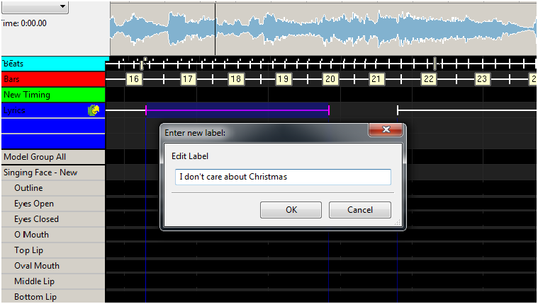
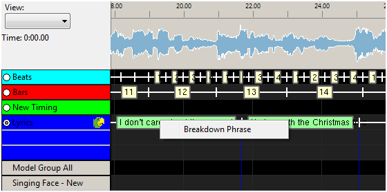
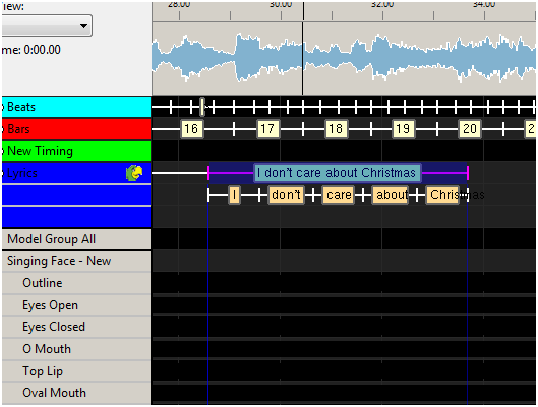
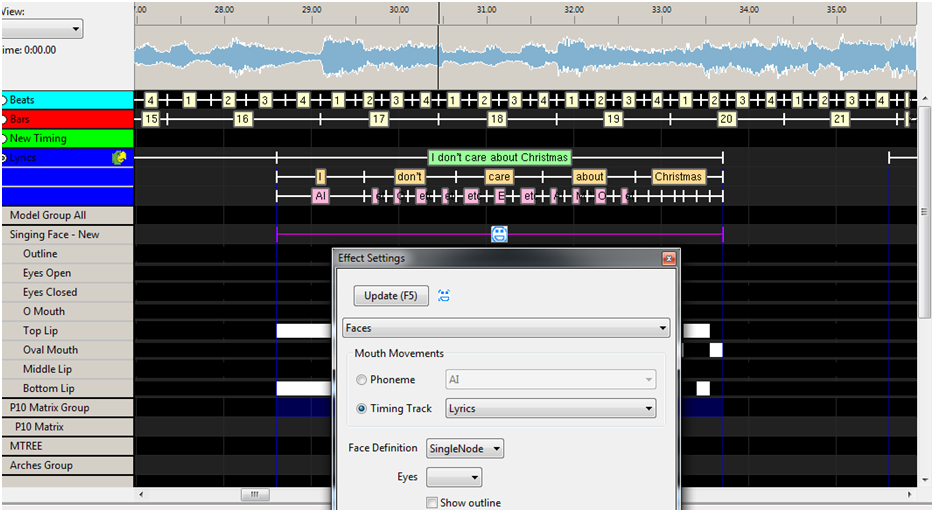
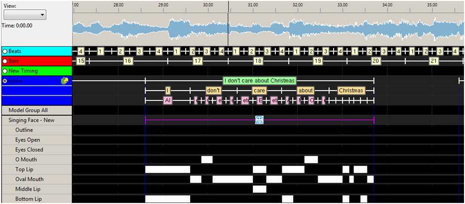
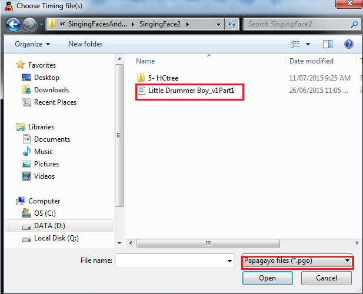
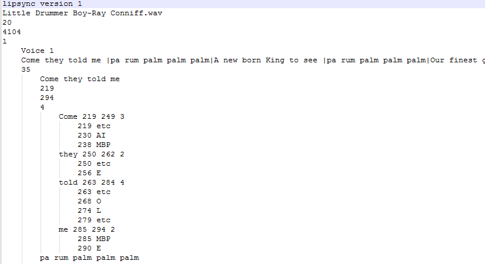

# Singing Faces

## Singing Faces

This section describes how Singing Face functionality i.e. the conversion of phrases from song lyrics or sentences spoken out aloud can be converted to work on Coro faces or Images on a matrix or Mega tree natively in xLights i.e. without using the Papagayo application.

### Face Definition

In the model layout tab, select the singing face model, then click on the ellipsis (three dots) button on the Faces property.

.png>)

 (1).png>)

The 'Name' dropdown specified the currently selected Face Definition. If the dropdown is empty, then no Face Definition exist for the current model.

.png>)

Click 'Add' to create a new Face Definition.

 (1).png>)

'Delete' will delete the current selected Face Definition.

.png>)

Click the ellipsis (three dots) to copy, rename or import a face definition.

 (1).png>)

The drop down box below the 'Name' selector is used to select the type of face definition. There are three types of face definition.

.png>)

| Type        | Use Case                                                              |
| ----------- | --------------------------------------------------------------------- |
| Single Node | Coro Faces with LED Lights/Dumb RGB Nodes. i.e. 7/8 Channel LOR Faces |
| Node Ranges | Coro Faces with Smart RGB Pixels Faces i.e. Boscoyo Singing Faces     |
| Matrix      | Smart RGB Pixels/P5/P10 Matrices                                      |

## Single Node

For each phoneme, select the channels that will be turned on. Multiple selections can be selected, by holding down the CTRL key.

.png>)

.png>)

If force custom colors is selected, then a specific color to be turned on by default. This can be specified for each phenom/row by double clicking in the color column to bring up the color palette.

.png>)

## Node Ranges

If ‘Node Ranges’ is selected, then the following window will be displayed.

 (1).png>)

Type in the list of node numbers (pixel numbers) for what should be turned for each movement. Example: ("1-12,24-30"). Double click the Nodes Column or Phenom Name to bring up the Node Select Dialog.

.png>)

Click and drag to select the desired nodes for the selected phenom definition.

 (2).png>)

Click Ok when done selecting the nodes for the current phenom name/row.

There is a right clicked menu that allows the user to import node numbers from a predefined submodel.

.png>)

If force custom colors is selected, then a specific color to be turned on by default. This can be specified for each phenom/row by double clicking in the color column to bring up the color palette.

.png>)

## Matrix

If a matrix is selected, then the following window will be displayed.

.png>)

Then for each mouth position, double click in the eyes open column (you may need to double click more than once) and navigate to and select the face image corresponding to that mouth position. You can specify different images for the Eyes Closed position or by default, the same image is copied across.

.png>)

The 'Download Images' button will display a list of user submitted singing faces images. Select the 'Insert Face' to download the pictures files to 'DownloadedFaces' folder in the show folder. This will also populate the face definitions in the main dialog.

 (1).png>)


Pay attention the image resolution compared to the matrix resolution. High resolution image will not scale well to low resolution matrices.


Then select the image placement i.e. Centered or Scaled. 'Center' with display the image in the center of the matrix. If the image resolution is greater than the matrix resolution, xLights will down scale the image to the matrix resolution. 'Scaled' will upscale the X and Y resolution of the image separately to the matrix resolution.

.png>)


Images used for pictures and faces use the location reference you specify when you added the image. xLights attempts to resolve the location of the image if it cannot be located where specified.

If the images are in your show directory or in a sub folder inside your show directory, then the image will be found. In other cases , the new location may not be detected.


## Timing Tracks

Next add a new Timing track. Right Click on the Row Heading and Select Add Timing Track

.png>)

Select a Timing Track of type ‘Empty’ and click on OK to add it.

.png>)

Right click on the name of the timing track and Select Rename Timing Track. Change it to something meaningful, such as ‘Lyrics’ or 'Main Vocals'.

If you have more than one Voice, then repeat this process for the second Voice.

## Importing Phrases

#### Phrases/Lyrics for Voice 1

Select the Timing Track (‘Lyrics’) and for clarity deselect any others. There are two ways to add the phrases/lyrics to the Timing Track.

1. Importing the entire set of Lyrics.  Obtain the lyrics from the internet or elsewhere, copy them, then Right click and select ‘Import Lyrics’.
2. Type or paste the lyrics into the Window and press OK. The words of the lyrics will be evenly distributed across the song.


It is also possible to import an entire timing track (that another person has exported) containing the Lyrics, Words and phonemes via the Import Timing Tracks option. The file must be an .xtimings file.


#### Using timing marks

Play through the song at regular or reduced speed and use the ‘t’ key to add timing marks at the beginning of each phrase. Then on the timing track, between two timing marks, double click or shirt double click (this is set by your preference dialog settings) and an ‘Edit label’ box will pop up. Type in, or copy and paste the words that pertain to the selected phrase (or phrases) that belong between the two timing marks. Press Ok to accept.

Repeat for as many phrases as you require or you can do one phrase at a time.

### Breakdown Phrases

You can break down all the phrases into words by right clicking on the timing track to the left of the Papagayo icon and selecting the Breakdown Phrases option. This will breakdown all the phrases into words or you can do this in sections i.e. Highlight a phrase or group of phrases, right click and accept the Breakdown Phrase option.

A list of words will be generated for the phrase in a timing track, just below the phrase.

### Breakdown Words

You can break down all the words into phonemes by right clicking on the Timing Track to the left of the Papagayo icon and selecting the Breakdown Words option. This will breakdown all the words into phonemes or you can do this in sections ie: highlight a group of words, right click and accept the Breakdown Word or Breakdown Selected Words option. If the Breakdown Selected Words option does not appear, ensure that your cursor is not pointing on a word, otherwise you may only see the Breakdown Word option.


Due to the loading of dictionaries, there could be a delay of several seconds the first time this is used in each session, while the first word is broken down.


A list of phonemes will be generated for the word or words phrase in a timing track, just below the word timing track.

Zoom in to see the words or phonemes more clearly. Drag the words to align them as required.

You also need to separately drag the phonemes to align them as required.

If you wish to regenerate a word or words, highlight the words, right click and select Breakdown Word or Breakdown Selected Words option.

Select and drag the Face effect to the sequence grid against the model (your Singing face model).


Ensure that the color selected on the color window is correct based on your model definition (White is the most common setting).



If the Timing track name (‘Lyrics1’) does not appear in the list of Timing Tracks, click on another effect and then return to the Face effect to force the list to be refreshed.


Using the Effects Setting window, under Mouth Movements, select the applicable Timing Track (‘Lyrics’). The face definition value will default to the one defined for the model.

You can also select ‘Show Outline’ which will activate the outline when the face effect is present and ‘Turn On/Off Eyes’, if you wish. Setting the eyes to Auto will cause the eyes to blink every few seconds when the rest phenome is on.

The timings should automatically appear against each mouth movement.

Repeat the process for the next phrase or group of phrases.

### Phrases / Lyrics for Voice 2

Similarly, repeat for the next Voice by selecting another model (‘Singing Face 2’), and the next Timing Track (‘Lyrics 2’). When you drop the Face effect on the sequence grid, select the second timing track (‘Lyrics 2’) as the Timing Track on the Effects option and proceed as described for Voice.


If you wish to assign a group of phrases/words/ phonemes from one Voice/timing Track to another, then against the model of the second voice (‘Singing face 2’), for the selected group of phrases (‘Chorus’), when you drop the Face effect, select the first timing track (‘Lyrics’) and the effects from that timing track will be duplicated.


### Checking for Unknown words in the dictionary

This step will help eliminate any words that xLights may not have in its library.

.png>)

As you breakdown words in xLights, occasionally you may see that there is no phonetic breakdown of the word placed in the timing track. As shown below.

As you can see there is no pink phonemes below the work ‘honkey’. This means that the word is not in the xLights work dictionary. To manually add word breakdowns, Use the User Library Dialog located in the Tools Menu.


[tools](../../chapter-five-menus/tools/)


### Importing Papagayo files

This section describes how you can import a Papagayo (.PGO) file into xLights as a timing track, so as to integrate it with xLights functionality and accordingly be able to edit and adjust it.

On the sequencer tab , after creating a new musical sequence or opening an existing musical sequence, right click on the Timing name and select Import Timing Track. Browse to the location of the Papagayo pgo file and select the file.

Specify the number of frames to offset the data by. Due to a performance limitation in the Papagayo software, a sequence often had to be broken up into segments. In which case the second segment had to be offset by the number of frames of the first segment.

For the first segment being imported the offset is zero. Click on OK.

The Phrases, words and phonemes are imported and a timing track with the three components is created for each Voice contained in the PGO file. The phrases, words and phonemes can then be edited, moved and adjusted similar to one that had been created within xLights.

The following image shows a snippet of what the file contains. The 4th line contains the total number of frames and the 5th line has the number of Voices in the file, followed by the details for each voice.

