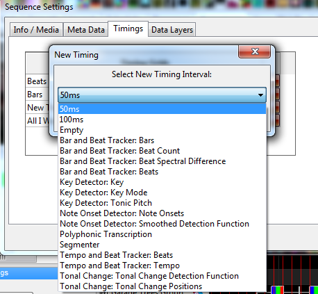
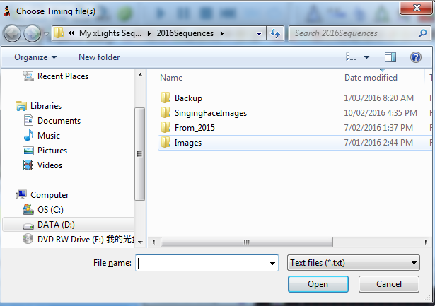
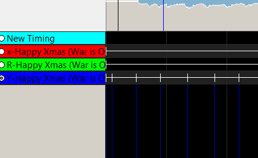
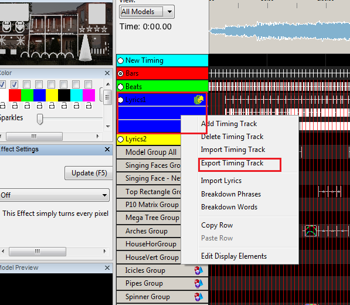

# Timing Tracks

## Timing Tracks

xLights can support multiple timing tracks on the sequencer, each with different frequencies of timing marks. By default, a timing track ‘New Timing’ is created for each sequence if you have not created one when creating a new sequence. Timing Tracks can be added via the File, Sequence Settings, Timing menu.

.png>)

Clicking on the down arrow will provide a drop down list of timing intervals to select from to create a timing track. Other than the first three, the remaining are from the VAMP plugins. If you have not installed the plugins then they will not appear in the list.

You can also import a Timing track that has been created externally. Click on the Import button instead of the New button. A window Chose Timing files(s) window will open, enabling you to browse for and select the timing file to be imported. Navigate to the .txt file containing the timing track and click OK to import it. The new timing track can be a lyric track with phrases and words broke down into phenoms.


If you are trying to import a LOR timing grid and it is not retrieved i.e. the window is empty, use any xml supported editor and check the LMS xml file for a section called \<timingGrids>. The section should contain a subsection called \<timingGrid> which must contain an attribute called "type=freeform".


When you create a timing track it gets added to all views that you have defined. Timing tracks are local to a sequence.


The timing marks create a grid but once the effects are dropped they have no relation to the original timing marks that were used to drop them. You can switch to any other timing track and have a completely different grid.


If you have multiple timing tracks defined,

* Each timing track has a different color of timing marks.
* You can select the timing track radio button (to the left of the timing track name) to enable that track. You can also select more than one timing track to be displayed at the same time, however only one timing track will be active for effects to calculate the start and end position.
* You can rename a timing track , by right clicking on the timing track name and then providing a new name in the window that gets displayed.

You can set up timing marks on any timing track manually, by placing your cursor on the waveform (above the grid) and while playing the sequence, press the ‘t’ key where you wish the timing mark to appear. This is equivalent to what is called a 'tapper' function.

You can also have xLights create fixed timing interval timing tracks by selecting the Metronome timing option and then choosing the timing interval.

### Fixed Timing Tracks

When xLights created a Metronome timing it is generated as a Fixed Timing Tracks. Fixed Timing Tracks are not editable and the timing marks cannot be changed. Fixed timing tracks are colored orange in the sequence tab by default.

.png>)

To edit a Fixed timing track the user must right click and select Make Timing Track Variable.

 (1).png>)

### Adding/Removing Timing Track

While on the sequencer tab, you can add new timing tracks or delete an existing timing track at any time.

Right Click , with your cursor in the area of the timing track names and select Add Timing Track or Delete Timing Track.

.png>)

### Importing Timing Track

You can also import timing marks created externally (the most common being those created via Audacity or another xLights sequence).

.png>)

This capability includes importing a Singing Face (xLights Papagayo) timing track.


If you wish to select and delete multiple timing marks all at once, uncheck the circle beside the timing track and then drag select with the yellow dashed rectangle and hit the delete key.


In order to import a timing track, right click the Timing names area, then select Import Timing Track, navigate to the .txt ,PGO, LMS, LOR, LSP, .xml, or .xtiming file containing the timing track and click OK to import it.

The timing tracks from the specified file are imported as xLights timing tracks - the following is an example of one that has been imported from LSP.

Importing of a PGO timing track is covered elsewhere in the document.

### Exporting Timing Track

Similarly to export a timing track, right click on the timing track name in the Timing names area, and save as as .xtiming file.

This capability includes exporting a singing face (xLights Papagayo) timing track.

You can export the file as a PGO file , if you wish to provide the file for use in another type of sequencer (LOR ). If you wish to use this in for another xLights sequencer , then export as an XTIMING file.

Multiple timing tracks can be exported to a single XTIMING file by selected them from the following dialog.

 (1).png>)


Timings are created just like effects which means they have a duration. Every timing effect has a starting edge and an ending edge. So you can have a timing effect that goes from 1 to 2 seconds and then another from 3 to 4 seconds with nothing in between 2 and 3 seconds. If you want one in there just select a range and hit "t" then drag the edges over to connect to the existing timing effects.


## Import Notes

The purpose of this function is to create a timing track by importing the notes from an external source such as a MIDI file, from an externally generated source such as Audacity or from a music XML file.

Right Click on the Timing Track name and select Import Notes.

.png>)

Specify a name for the Timing Track to be created , the Notes Source, and then navigate to and select the file from which the notes are to be Import.

.png>)

Click OK and the Timing track will be created from the notes.

Once the timing track that has been created , it can be edited or adjusted if required.

Subsequently , when when using the Piano effect , specify the Timing Track that has been created as the Notes source.
