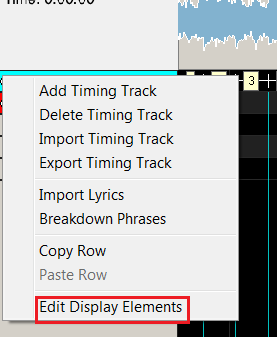

# Adding Models to a View

## Adding Models to a View


All Model are added to the Master View by default, when creating a New Sequence, this section can be skipped unless you are adding new models to an existing sequence.


Models added to the layout after a sequence was created must be added to a View so that the models are then available to place effects against. Each sequence has a ‘Master View’ that is automatically created. The Master View defines a list of models that are specific to that sequence only. For this example, we will use the Master View.


It is worthwhile creating another View that contains all your models (or a common set of models) which can then be used in all your sequences so that they do not have to be added each time.


Right click on the Timing grid names (in the area highlighted on the screen).

.png>)

Select the Edit Display Elements option from the pop up window.

Select the Master View from the top window.

 (1).png>)

From the Left window select the items you would like to add and Click the Right Arrow Button. If you select the Double Right Arrow all the items (All Models, Arch1, and Arches Group) will be added.

.png>)

Click on Close when done.
