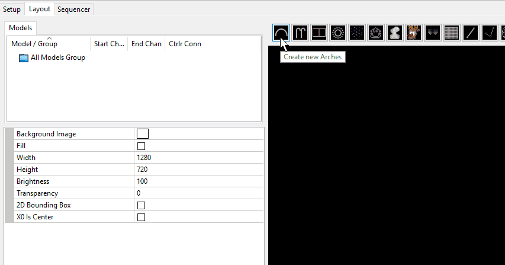
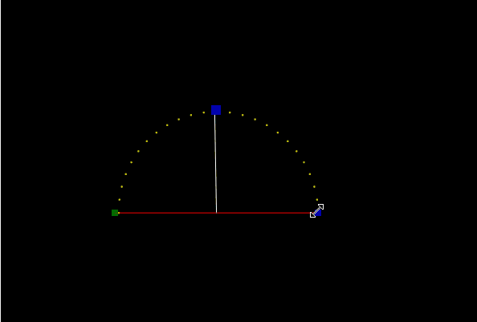

# Model Definition

## **Model Definition**

In this section, we will define a Model, a Model Group, and add the model to the Model Group. Model and Model Group definitions are persistent, are to be defined once and can then be used in all your sequences.

As an example, I am creating an Arch model and will call it ‘Arch 1’. The arch is about 2.5 metres long and as such is made up of 25 RGB pixels.

Click on the Layout tab, then click on the Arches icon. The selected icon will have a blue square around it.

.png>)

Then click anywhere on the Canvas and drag slightly. An image of an arch will be displayed and an Arch model called ‘Arches’ (the default name that is assigned to the model may be slightly different) will be created with a default set of model settings.

Change the Model name to ‘Arch-1’. Click the Tab or Enter Key to set the new name.

.png>)

Change the Nodes Per Arch value to 25.

.png>)

Set the controller to "Main Controller" or whatever name you set in the controller tab.

.png>)

Set the Controller Connection Port to 1. This is the port of the controller the model will be physically  connected too.

.png>)

The Start and End channel will be automatically calculated by xLights based on the model settings and the controller settings selected.

.png>)

If you are adding a second model to the same controller port, set the model chain order to determine the model order on the controller output.

.png>)

.png>)


You can change the model name or any settings by typing over/editing the settings field. For some settings, click in the settings field, to the right of the setting name.



After changing an settings, use the Tab or Enter key to confirm the change.


Use the blue dots around the model to resize and rotate it if required. To move the model click and drag it to the desired location. The green dot should at the left side of the screen. When it is aligned horizontally, a red line is displayed between the green and blue dots.

The starting location of the model can be changed to the 'Blue' or 'Green' square.

.png>)

Click on the Save button (just below the Models button) to save the work that you have done so far. This includes the Model definition and its position on the Layout.

.png>)


The 'Save' button will appear red when unsaved changes are present.

